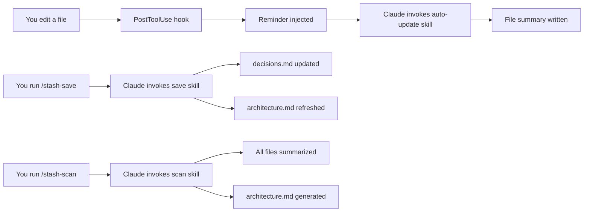

TokenStash keeps Claude in sync with your codebase using three mechanisms: auto-updates, manual saves, and full scans. Here's how the system works under the hood.

## Building the Stash

TokenStash builds your project cache through three complementary methods:

### Auto-Update (After Every Edit)

Whenever you edit a file, the **PostToolUse hook** triggers automatically:

<Steps>
  <Step title="Detect file changes">
    The `PostToolUse` hook watches for `Write` and `Edit` tool calls
    
    ```bash
    # From hooks/post-tool-use
    if [[ "$tool_name" != "Write" && "$tool_name" != "Edit" ]]; then
      exit 0
    fi
    ```
  </Step>
  
  <Step title="Trigger auto-update skill">
    Claude receives a reminder to update the file summary:
    
    ```xml
    <tokenstash-reminder>
    You just edited `src/lib/utils.ts`. 
    Use the tokenstash:auto-update skill to update its summary now.
    </tokenstash-reminder>
    ```
  </Step>
  
  <Step title="Write file summary">
    The `auto-update` skill writes to `.tokenstash/files/<path>.md`:
    
    ```markdown
    **Purpose:** Utility functions for string manipulation and validation.
    **Key exports:** sanitize(), validate(), formatDate()
    **Patterns:** Pure functions, no side effects
    **Last updated:** 2026-03-13
    ```
  </Step>
</Steps>

<Info>
Auto-updates run **asynchronously** — they don't block your workflow.
</Info>

### Manual Save (End of Session)

Run `/stash-save` to capture decisions and architecture:

<Steps>
  <Step title="Update decisions.md">
    Append the session summary with what changed and why:
    
    ```markdown
    ## 2026-03-13 — Added user authentication
    
    **Decisions:**
    - Use JWT tokens instead of sessions (stateless, scales better)
    - Store refresh tokens in httpOnly cookies (XSS protection)
    
    **Files changed:** auth/login.ts, middleware/verify.ts
    ```
  </Step>
  
  <Step title="Refresh architecture.md">
    If the codebase structure changed (new modules, patterns, dependencies), rewrite the architecture doc to reflect current state.
  </Step>
  
  <Step title="Sweep file summaries">
    Summarize any files you edited or read that don't have summaries yet.
  </Step>
</Steps>

### Full Scan (New Projects)

Run `/stash-scan` to index the entire repository:

<Steps>
  <Step title="Find repo root">
    ```bash
    git rev-parse --show-toplevel
    ```
    All stash files go in `<repo-root>/.tokenstash/`
  </Step>
  
  <Step title="Discover files">
    List all files, excluding:
    - `.git/`, `node_modules/`, `.tokenstash/`, `dist/`, `build/`, `.next/`
    - Binary files (images, fonts, compiled artifacts)
    - Files over 500 lines (skipped with a note)
  </Step>
  
  <Step title="Summarize each file">
    Write `.tokenstash/files/<flattened-path>.md` for every file
  </Step>
  
  <Step title="Generate architecture.md">
    Based on the full codebase picture, write the architecture overview:
    
    ```markdown
    ## Architecture Overview
    Express API with TypeScript, PostgreSQL database, Redis cache.
    
    ## Key Components
    - `src/routes/`: API endpoint handlers
    - `src/models/`: Database schemas (Prisma)
    - `src/middleware/`: Auth, validation, error handling
    
    ## Patterns
    - Repository pattern for data access
    - Middleware chain for request processing
    
    ## Tech Stack
    - Node.js, Express, TypeScript
    - PostgreSQL, Prisma ORM
    - Redis for caching
    ```
  </Step>
</Steps>

<Tip>
Use `--force` to re-scan all files and overwrite existing summaries.
</Tip>

## Loading the Stash

At the start of every Claude session, the **SessionStart hook** injects your stash into context:

<Steps>
  <Step title="Session starts">
    The `SessionStart` hook triggers on:
    - `startup` — New session
    - `resume` — Resuming after idle
    - `clear` — After clearing context
    - `compact` — After compacting history
  </Step>
  
  <Step title="Load global stash">
    From `~/.claude/tokenstash/`:
    ```bash
    preferences.md  # Your coding preferences
    rules.md        # Global rules for all projects
    ```
  </Step>
  
  <Step title="Load project stash (priority)">
    From `<repo-root>/.tokenstash/`:
    ```bash
    architecture.md  # Codebase structure
    decisions.md     # Decision log
    rules.md         # Project-specific rules
    files/*.md       # Per-file summaries
    ```
    
    Project files **override** global files with the same name.
  </Step>
  
  <Step title="Inject into context">
    All stash content is wrapped in `<tokenstash>` tags and added to Claude's context:
    
    ```xml
    <tokenstash>
    ## Project: architecture.md
    [architecture content]
    
    ## Project: decisions.md
    [decisions content]
    
    ## File Summaries (47 files cached)
    ### src/index.ts
    **Purpose:** Application entry point...
    </tokenstash>
    ```
  </Step>
</Steps>

<Note>
If no stash is found, Claude sees: "TokenStash: No stash found. Run /stash-scan to index this project."
</Note>

## The Skills System

TokenStash uses three skills that Claude invokes automatically:

| Skill | Triggered By | Purpose |
|-------|--------------|----------|
| `tokenstash:auto-update` | PostToolUse hook (after edits) | Update file summary silently |
| `tokenstash:save` | `/stash-save` command | Save session decisions and architecture |
| `tokenstash:scan` | `/stash-scan` command | Index entire repository |

### Skill Invocation Flow



## Hook Configuration

From `hooks/hooks.json`:

```json
{
  "hooks": {
    "SessionStart": [
      {
        "matcher": "startup|resume|clear|compact",
        "hooks": [
          {
            "type": "command",
            "command": "'${CLAUDE_PLUGIN_ROOT}/hooks/run-hook.cmd' session-start",
            "async": false
          }
        ]
      }
    ],
    "PostToolUse": [
      {
        "matcher": "Write|Edit",
        "hooks": [
          {
            "type": "command",
            "command": "'${CLAUDE_PLUGIN_ROOT}/hooks/run-hook.cmd' post-tool-use",
            "async": true
          }
        ]
      }
    ]
  }
}
```

<Info>
**SessionStart** runs synchronously (blocks until complete) to ensure context is loaded before Claude responds.

**PostToolUse** runs asynchronously (doesn't block your workflow).
</Info>

## Why This Design?

**Automatic context loading** means you never have to remember to load your stash — it's just there.

**Silent auto-updates** keep file summaries fresh without interrupting your flow.

**Manual saves** give you control over when to capture decisions and architecture changes.

**Full scans** let you index a new project upfront or refresh everything with `--force`.

The result: Claude always starts with full context, and the stash builds itself as you work.
